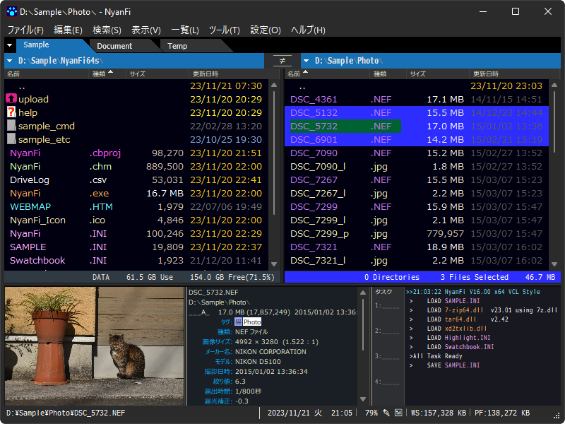

# NyanFi_x64s

## 概要

キーボード操作主体の2画面ファイラーです(マウス操作も可能)。  
Windows 7 ～ Windows 11 で動作します。  

これは、64ビット従来版 V15.63 をベースに作成した、ライト/ダークモード表示可能なVCLスタイル版です。  
INIファイルなどは、従来版のものを流用できます。  

## 開発環境

C++Builder 12 (BCC64)
